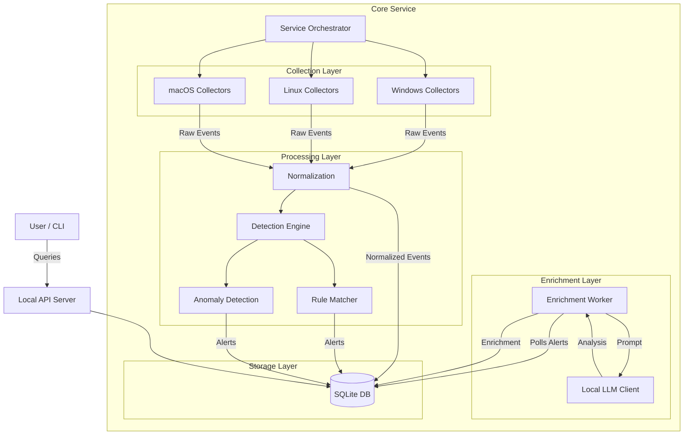

# 🛡️ Local LLM-Driven Threat-Hunting Assistant (`thhunt`)


---

## 📖 Table of Contents

1. [Introduction](#-introduction)
2. [Key Features](#-key-features)
3. [System Architecture](#-system-architecture)
4. [Project Structure](#-project-structure)
5. [Installation & Setup](#-installation--setup)
6. [Configuration Guide](#-configuration-guide)
7. [Writing Detection Rules](#-writing-detection-rules)
8. [API Reference](#-api-reference)
9. [Troubleshooting](#-troubleshooting)
10. [Roadmap](#-roadmap)

---

## 📖 Introduction

The **Local LLM-Driven Threat-Hunting Assistant** (`thhunt`) is a cutting-edge, cross-platform endpoint security agent. It is designed to bridge the gap between traditional signature-based detection and modern AI-driven analysis—**without sending a single byte of data to the cloud**.

By running a lightweight background service, `thhunt` continuously monitors your system for suspicious activity. When a potential threat is detected, it doesn't just log a cryptic code; it uses a **local Large Language Model (LLM)** (like Llama 3 running via Ollama) to analyze the context, explain *why* it's suspicious, and recommend concrete investigation steps.

---

## ✨ Key Features

* **🔒 100% Local Processing**: All telemetry, analysis, and enrichment happen on your device. Zero data exfiltration risk.
* **🖥️ Cross-Platform**: Native collectors for **Windows** (PowerShell/WMI), **Linux** (/proc, inotify), and **macOS** (FSEvents, ps).
* **🧠 Hybrid Detection Engine**:
  * **Deterministic Rules**: YAML-based rules for known bad patterns (e.g., "Process running from /tmp").
  * **Anomaly Detection**: Baseline-based detection for new binaries and unknown network connections.
* **🤖 AI Enrichment**: Automatically enriches alerts with:
  * Human-readable summaries.
  * Contextual severity scores.
  * MITRE ATT&CK mapping (via prompt context).
  * Step-by-step investigation guides.
* **⚡ High Performance**: Written in Python with optimized, threaded collectors and WAL-mode SQLite storage.

---

## 🏗️ System Architecture

The system is built as a modular background service with strict separation of concerns.

### High-Level Architecture



### Data Flow Pipeline

1. **Collection**: OS-specific collectors gather raw data (e.g., `Get-Process` output).
2. **Normalization**: Raw data is converted into a standard JSON schema (Category, Action, Subject).
3. **Detection**:
    * **Baselines**: Is this binary new? Is this IP new?
    * **Rules**: Does this match a known threat pattern?
4. **Alerting**: If suspicious, an Alert object is created in the DB.
5. **Enrichment**: A background worker picks up the alert, sends context to the local LLM, and saves the AI's analysis.

### Cross-OS Collector Mapping

| Category | Linux | Windows | macOS |
| :--- | :--- | :--- | :--- |
| **Process** | `/proc` scanning | PowerShell / WMI | `ps`, `proc_pidpath` |
| **Network** | `/proc/net/tcp` | `Get-NetTCPConnection` | `netstat`, `lsof` |
| **File** | `inotify` | `FileSystemWatcher` | `FSEvents` |
| **Persistence** | `crontab`, `systemd` | Registry, Scheduled Tasks | LaunchDaemons, LaunchAgents |
| **Auth** | `/var/log/auth.log` | Event Log (Security) | Unified Logging (`log`) |

---

## � Project Structure

```text
thhunt/
├── api/          # Local REST API (Flask)
├── baselines/    # Anomaly detection logic (SQLite-backed)
├── collectors/   # OS-specific telemetry collectors
│   ├── linux/    # Linux implementations
│   ├── windows/  # Windows implementations
│   └── macos/    # macOS implementations
├── config/       # Configuration loading & schema
├── core/         # Service orchestrator & threading
├── detection/    # Detection pipeline & logic
├── enrichment/   # LLM enrichment worker
├── install/      # Installation scripts (Service wrappers)
├── llm/          # LLM client integration (Ollama/OpenAI)
├── normalization/# Event normalization logic
├── rules/        # YAML detection rules & engine
├── storage/      # Database layer (SQLite)
├── tests/        # Unit & integration tests
├── ui/           # CLI tool
└── utils/        # Helper utilities (Logger, etc.)
```

---

## ⚙️ Installation & Setup

### Prerequisites

* **Python 3.8+**
* **Ollama** (or compatible local LLM provider) running on `localhost:11434`.
  * *Recommended Model*: `llama3` or `mistral`.

### Developer Setup

1. **Clone the repository**:

    ```bash
    git clone https://github.com/yourusername/thhunt.git
    cd thhunt
    ```

2. **Create a virtual environment**:

    ```bash
    python -m venv venv
    # Windows
    .\venv\Scripts\activate
    # Linux/macOS
    source venv/bin/activate
    ```

3. **Install dependencies**:

    ```bash
    pip install -r requirements.txt
    ```

4. **Start the Service**:

    ```bash
    python -m thhunt.core.service
    ```

### Using the CLI

Interact with the running agent using the built-in CLI tool.

```bash
# Check system status
python -m thhunt.ui.cli status

# List recent alerts
python -m thhunt.ui.cli alerts --since 24h

# View details of a specific alert
python -m thhunt.ui.cli alert <alert_id>
```

---

## 🔧 Configuration Guide

The system is configured via `config.yaml` in the root directory.

```yaml
# General Settings
os_type: windows  # auto-detected usually
host_id: my-machine-01

# Database Storage
database:
  path: thhunt.db

# Local LLM Settings
llm:
  provider: ollama
  base_url: http://localhost:11434
  model: llama3
  timeout: 30

# Collector Intervals (seconds)
collectors:
  process_interval_seconds: 5
  network_interval_seconds: 10

# Detection Settings
detection:
  rules_path: thhunt/rules
  enable_anomaly_detection: true

# API Server Settings
api:
  host: 127.0.0.1
  port: 9999
```

---

## 🛡️ Writing Detection Rules

Detection rules are written in YAML and stored in `thhunt/rules/`.

**Example Rule (`suspicious_netcat.yml`):**

```yaml
name: Suspicious Netcat Execution
description: Detects execution of netcat, often used for reverse shells.
severity: 8
conditions:
  category: process
  process_name: nc
  # Optional: Check command line arguments
  # cmdline_contains: "-e" 
```

**Supported Conditions:**

* `category`: `process`, `network`, `file`, `persistence`, `auth`
* `process_name`: Exact match of binary name.
* `process_path_contains`: Substring match on path.
* `remote_ip`: Match specific remote IP.

---

## 🔌 API Reference

The service exposes a local-only REST API.

| Endpoint | Method | Description |
| :--- | :--- | :--- |
| `/status` | `GET` | Returns service health and collector status. |
| `/alerts` | `GET` | Returns a list of recent alerts. |
| `/alerts/<id>` | `GET` | Returns full details (including enrichment) for an alert. |

**Example Response (`/alerts/1`):**

```json
{
  "id": 1,
  "timestamp": 1715432100.0,
  "severity": "8",
  "rule_name": "Suspicious Process in Temp",
  "description": "Rule: Suspicious Process in Temp",
  "is_enriched": true,
  "enrichment": {
    "summary": "A process named 'malware.exe' was executed from a temporary directory.",
    "severity_score": 9,
    "threat_category": "Execution",
    "recommendations": "1. Terminate the process immediately.\n2. Scan the file."
  }
}
```

---

## ❓ Troubleshooting

**Issue: "LLM generation failed" in logs.**

* **Fix**: Ensure Ollama is running (`ollama serve`) and the configured model (`llama3`) is pulled (`ollama pull llama3`). Check `config.yaml` URL.

**Issue: "Permission denied" on Linux/macOS.**

* **Fix**: Some collectors (like reading `/var/log/auth.log` or using `inotify` on system dirs) require root privileges. Run the service with `sudo`.

**Issue: No alerts appearing.**

* **Fix**: Check `thhunt.log`. Ensure collectors are running. Try triggering a rule manually (e.g., run a process named `nc` or put a binary in a Temp folder if a rule exists for it).

---

## 🗺️ Roadmap

* [x] **Phase 1: Core Foundation** (Service, DB, Basic Collectors)
* [x] **Phase 2: Detection Engine** (Rules, Baselines)
* [x] **Phase 3: AI Enrichment** (Local LLM Integration)
* [ ] **Phase 4: Advanced Collectors** (Full File/Persistence monitoring)
* [ ] **Phase 5: Web Dashboard** (Visual UI for alerts)
* [ ] **Phase 6: Production Packaging** (MSI, Deb, Pkg installers)

---

<p align="center">
  Made with ❤️ for Privacy and Security by <b>ANAND BINU ARJUN</b>.
</p>
